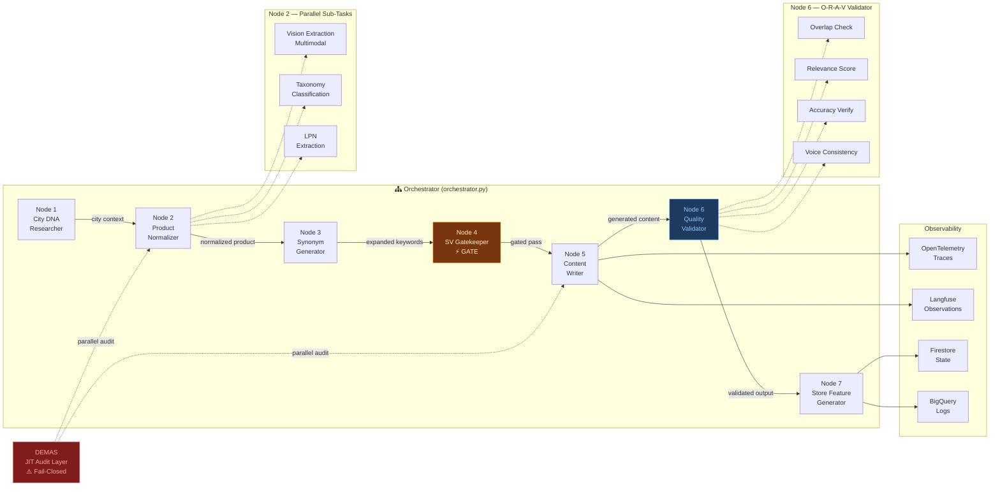

# Agent DAG Pipeline — Multi-Agent Orchestration Architecture

A production-grade 7-node Directed Acyclic Graph (DAG) for autonomous content generation, featuring fail-closed policy enforcement, model hot-swapping, multimodal vision extraction, and LLM-as-Judge quality validation.

## Table of Contents

- [Architecture](#architecture)
- [Model Portfolio](#model-portfolio-hot-swappable)
- [Key Design Decisions](#key-design-decisions)
- [Observability Stack](#observability-stack)
- [Data Sources](#data-sources)
- [Related Projects](#related-projects)
- [License](#license)

> **Status**: Live in production across 5 countries, 131 deployment targets, 3 model generations.

## Architecture

## Model Portfolio (Hot-Swappable)

| Model | Type | Usage | Invocations |
|---|---|---|---|
| `gemma-3-4b-it` | Vertex AI SLM | Text + Multimodal | 27,423 |
| `gemma-4-26b-a4b` | Vertex AI MoE | Text + Multimodal | 1,438 |
| `gemini-2.5-flash-lite` | Vertex AI | Text + Multimodal | 5,759 |
| `cached` (Redis LTM) | Redis Cache | Cache hits | 8,454 |

## Key Design Decisions

### Fail-Closed Policy
Any node failure → record to Firestore → product **NOT** sent downstream. No silent failures.

### DEMAS JIT Audit
Parallel audit layer runs alongside content generation. Acts as an independent quality gate with a 68.9% pass rate — intentionally aggressive to catch edge cases.

### O-R-A-V Dual-Layer Validation
Node 6 runs both deterministic checks (overlap, accuracy) and LLM-as-Judge scoring (relevance, voice) to create a mixed-metric evaluation system.

### Model Hot-Swap Architecture
Models are swappable at the node level without pipeline changes. Timeline:
- **Mar 24–31**: `gemma-3-4b-it` (initial deployment)
- **Apr 5–6**: `gemma-4-26b-a4b` (MoE evaluation — see [forensic runbook](https://github.com/Manzela/gemma4-vllm-deployment))
- **Apr 13+**: `gemini-2.5-flash-lite` (current production)

## Observability Stack

- **OpenTelemetry**: Distributed tracing across all 7 nodes
- **Langfuse**: LLM observation, scoring, and prompt versioning
- **Firestore**: State management and execution records
- **BigQuery**: Long-term execution log archival (48K+ node-level entries)
- **Redis**: LTM cache layer + budget lease management

## Data Sources

All metrics in this document are derived from verifiable production data:

| Metric | Source | Dataset |
|---|---|---|
| Node executions (48K+) | BigQuery | `pipeline_logs.node_logs_changelog_raw_changelog` |
| Deployment targets (131) | BigQuery | `json_sync_dataset.json_data` |
| Model invocations | BigQuery | `model_name` field in node logs |
| Cache hits (8,454) | BigQuery | `model_source = 'redis_ltm_cache'` filter |
| Store count (109) | BigQuery | `DISTINCT store_name` in json_data |

## Related Projects

- [`antigravity-os`](https://github.com/Manzela/antigravity-os) — Governance kernel with OPA policies, cost guard, and self-healing CI/CD
- [`gemma4-vllm-deployment`](https://github.com/Manzela/gemma4-vllm-deployment) — Forensic deployment runbook for Gemma 4 26B MoE on Vertex AI

## Interactive Visualizations

- [`index.html`](index.html) — Pipeline Observatory: execution traces, model timeline, geographic fanout
- [`architecture.html`](architecture.html) — Deep Architecture View: node anatomy, closed-loop autonomy, multi-model evaluation, self-improving state machine

## Enterprise Scale

Production throughput across 11 enterprise clients: ~7.9M PDPs per generation cycle, ~55M node operations per cycle, ~305M monthly node operations including daily price/inventory deltas. Each PDP traverses the full 7-node DAG with ~3 sub-agents per node, yielding ~116M sub-agent executions per cycle. Pipeline is fully autonomous, auto-scaling (up to 1,000 concurrent Modal workers), and self-healing.

## License

Apache-2.0
