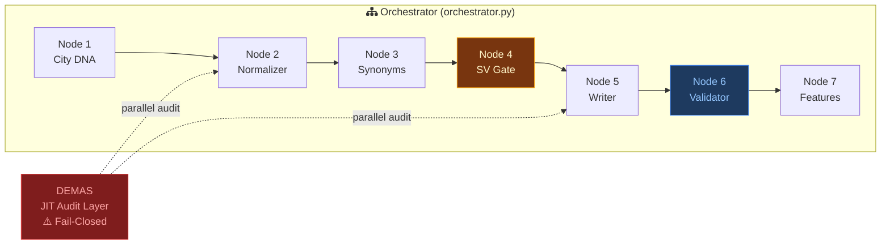

# Pipeline Observatory

A publication-grade interactive dashboard and architectural documentation for an autonomous 7-node Directed Acyclic Graph (DAG) pipeline. It features mechanistic interpretability visuals, fail-closed policy enforcement (DEMAS), and enterprise-scale execution telemetry.

🌍 **Live Demo:** [manzela.github.io/pipeline-observatory](https://manzela.github.io/pipeline-observatory)

## Table of Contents
- [Interactive Visualizations](#interactive-visualizations)
- [Architecture Overview](#architecture-overview)
- [Enterprise Scale](#enterprise-scale)
- [Project Documentation](#project-documentation)
- [License](#license)

## Interactive Visualizations

This repository hosts two core dashboards built with vanilla HTML/CSS/JS (zero dependencies) for maximum performance and sub-millisecond load times.

- 📊 **[Observatory Dashboard (`index.html`)](https://manzela.github.io/pipeline-observatory/index.html)**
  Live execution telemetry, model evolution timelines, geographic fanout, and an anonymized trace stream of multi-agent interactions.

- 🧠 **[Deep Architecture View (`architecture.html`)](https://manzela.github.io/pipeline-observatory/architecture.html)**
  A deep-dive explorer featuring a 7-node sequential reveal, "Glass Box" MoE/LoRA interpretability visualizations, and the O-R-A-V validation stack.

## Architecture Overview

### Key Design Decisions
- **Fail-Closed Policy (DEMAS):** A Just-In-Time parallel audit layer running alongside generation. Any failure halts downstream propagation.
- **O-R-A-V Validation:** Node 6 runs Overlap, Relevance, Accuracy, and Voice checks via LLM-as-Judge.
- **Model Hot-Swapping:** Zero-downtime swaps between Gemma 3/4 and Gemini 2.5/3.1 Flash-Lite.

## Enterprise Scale
Production throughput across 11 enterprise clients:
- **~7.9M PDPs** (Product Detail Pages) per generation cycle.
- **~55M Node operations** per cycle.
- Auto-scaling up to 1,000 concurrent Modal workers.

## Project Documentation
We adhere to high open-source standards. Please review the following guidelines:
- [CHANGELOG.md](CHANGELOG.md) - History of architectural and UX improvements.
- [ROADMAP.md](ROADMAP.md) - Strategic vision and upcoming features.
- [SECURITY.md](SECURITY.md) - Security policy and vulnerability reporting.
- [CONTRIBUTING.md](CONTRIBUTING.md) - How to run, test, and contribute.
- [CODE_OF_CONDUCT.md](CODE_OF_CONDUCT.md) - Community standards.

## Related Projects
- [`antigravity-os`](https://github.com/Manzela/antigravity-os) — Governance kernel with OPA policies and cost guard.
- [`gemma4-vllm-deployment`](https://github.com/Manzela/gemma4-vllm-deployment) — Forensic deployment runbook for Gemma 4 MoE.

## License
[Apache-2.0](LICENSE)
